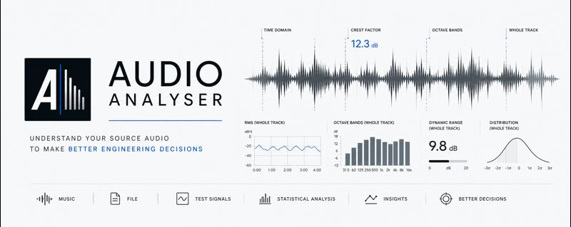

# Audio Analyser

Audio Analyser is an offline analysis tool for music, film, and test-signal audio. It measures octave-band level, crest factor, time-domain dynamics, envelope behaviour, sustained peaks, and channel/group behaviour across mono, stereo, and surround material. Analysis results are stored as portable per-track `.aaresults` bundles, which can then be rendered into plots, manifests, Markdown reports, and portable PDF reports without reprocessing the source audio.

## Recommended Route: Desktop GUI

For most users, the Windows desktop GUI is the easiest way to use Audio
Analyser. The packaged build is self-contained: it includes the Python runtime
and Python dependencies, so normal use does not require installing Python,
creating a virtual environment, or running command-line tools.

### Download (Windows GUI)

1. Open this repository on GitHub and go to **Releases**.
2. Download the latest Windows package (the `.zip` attached to the release).
3. Extract the zip somewhere writable (for example `Documents\AudioAnalyser\`).
4. Run `AudioAnalyser\AudioAnalyser.exe`.

Notes:

- Keep the whole extracted `AudioAnalyser\` folder together (do not copy just the
  `.exe` elsewhere) because the app needs the bundled runtime files next to it.
- If Windows SmartScreen blocks the first run: **More info** → **Run anyway**.

The packaged Windows build includes `ffmpeg.exe` and `ffprobe.exe` for
MKV/TrueHD workflows. Source/development runs can also use a system FFmpeg
installation on `PATH`; if FFmpeg is missing, analysis fails with a clear log
message explaining what needs to be installed.

Basic workflow:

1. Download or build the Windows GUI package.
2. Run `AudioAnalyser.exe`.
3. Select an input audio file or folder.
4. Select a project folder.
5. Choose simple options such as batch workers and per-track memory estimate.
6. Start analysis and watch per-file progress in the GUI.

The GUI writes portable analysis bundles to `<project>/analysis/` and rendered
plots/reports to `<project>/rendered/`. Reports are written as both
`analysis.md` and `analysis.pdf`. Those `.aaresults` bundles can be shared or
re-rendered later without reprocessing the source audio.

Packaged builds are created with PyInstaller and produce a `dist/AudioAnalyser/`
folder containing `AudioAnalyser.exe` plus its runtime files. See
[`docs/windows_gui_packaging.md`](docs/windows_gui_packaging.md) for build and
packaging notes.

## Features

- **Desktop GUI**: Primary route for most users, with file/folder selection, project-folder output, simple options, logs, and per-file progress
- **Audio Processing**: Load and preprocess various audio formats (WAV, FLAC, MP3, MKV, etc.)
- **Multi-Channel Support**: Process stereo and surround audio with separate analysis per channel
- **MKV/TrueHD Support**: Extract and decode Dolby TrueHD audio from MKV containers (requires ffmpeg)
- **RP22 Channel Naming**: Automatic channel identification using RP22 standard (FL, FC, FR, SL, SR, etc.)
- **Octave Band Filtering**: Apply octave band filters from **8 Hz** through 16 kHz (IEC 16 Hz–16 kHz series plus an 8 Hz sub-bass band) including cinema/LFE analysis
- **Advanced Statistics**: Comprehensive analysis including clipping detection, dynamic range, spectral characteristics
- **Bundle-First Output**: Store derived per-track analysis data in portable `.aaresults` bundles
- **Separate Rendering**: Generate graphs, Markdown reports, and PDF reports from bundles without reloading source audio
- **Legacy CSV Export**: Optional compatibility export for the old `analysis_results.csv` workflow
- **Configuration System**: TOML-based configuration with command-line overrides
- **Content Classification**: Automatic tagging of Music/Film/Test Signal content based on folder structure
- **Command Line Interface**: Professional CLI with extensive customization options

## Developer Setup

These steps are for contributors, CLI users, and anyone building the GUI package
from source. They are not needed for normal use of a packaged Windows build.

### Prerequisites
- Python 3.8 or higher
- Git
- **ffmpeg** (required for MKV/TrueHD support in source/development runs): install the ffmpeg tools package from [https://ffmpeg.org/download.html](https://ffmpeg.org/download.html), add its `bin` folder to `PATH`, then restart the app or terminal. Packaged Windows builds include bundled FFmpeg binaries.

### Installation

1. Clone the repository:
```bash
git clone <repository-url>
cd audio-analyser
```

2. Create and activate a virtual environment:
```bash
# Windows PowerShell
python -m venv venv
.\venv\Scripts\Activate.ps1

# Windows Command Prompt
python -m venv venv
.\venv\Scripts\activate.bat

# Linux/macOS
python -m venv venv
source venv/bin/activate
```

3. Install dependencies:
```bash
pip install -e ".[dev]"
```

## Configuration

The Audio Analyser uses a TOML-based configuration system (`config.toml`) that allows you to customize all analysis parameters. You can override any setting via command-line arguments.

### Configuration File (`config.toml`)

The configuration file is organized into sections:

```toml
[analysis]
chunk_duration_seconds = 2.0        # Time-domain analysis chunk size
sample_rate = 44100                 # Audio processing sample rate
tracks_dir = "Tracks"               # Default tracks directory
output_dir = "analysis"             # Default output directory
time_domain_crest_factor_mode = "fixed_window"  # Primary time-series crest method
crest_factor_window_seconds = 2.0   # Fixed-window crest factor window
crest_factor_step_seconds = 1.0     # Fixed-window crest factor hop
crest_factor_rms_floor_dbfs = -80.0 # Below this, crest factor is stored/plotted as missing
peak_hold_tau_seconds = 1.4         # Slow diagnostic peak-hold release time
time_domain_slow_rms_tau_seconds = 1.0  # IEC Slow RMS time constant
octave_max_memory_gb = 8.0          # Per-track octave memory estimate, not a hard cap
octave_center_frequencies = [8.0, 16.0, 31.25, 62.5, 125.0, 250.0, 500.0, 1000.0, 2000.0, 4000.0, 8000.0, 16000.0]

[performance]
enable_parallel_batch = true        # Analyze multiple tracks at once in batch mode
max_batch_workers = 8               # Maximum concurrent track analyses

[plotting]
octave_spectrum_figsize = [12, 8]   # Figure dimensions
octave_spectrum_xlim = [7, 20000]   # X-axis limits (Hz); low end supports 8 Hz band
octave_spectrum_ylim = [-60, 3]     # Y-axis limits (dBFS)
dpi = 300                           # Plot resolution
render_dpi = 150                    # Default DPI for python -m src.render

[export]
generate_analysis_bundle = true     # Write .aaresults bundles during analysis
generate_legacy_csv = false         # Optional old analysis_results.csv export

[advanced_stats]
hot_peaks_threshold_db = -1.0       # Near-clipping threshold
clip_events_threshold_db = -0.1     # Actual clipping threshold
peak_saturation_threshold_db = -3.0  # Heavily compressed threshold
transient_threshold_db = 3.0        # Significant level change threshold
```

### Crest Factor Direction

Crest factor now follows two explicit processing paths:

- **No time axis**: full-track, full-channel, and octave-band spectrum summaries use whole-interval crest factor: `max(abs(signal)) / rms(signal)` over the same complete interval.
- **Time axis**: crest-factor time graphs and tables use the configured mode: `fixed_window`, `slow`, or `fixed_chunk`. The default report method is `fixed_window` with a 2-second window, 1-second hop, and `NaN` gaps for below-floor/silent windows.

The old hybrid summary method (whole-band RMS with a separate 1-second sliding peak) is intentionally not used for band/spectrum crest factor.

### Command Line Overrides

You can override any configuration parameter via command-line arguments:

```bash
# Override chunk duration for finer time resolution
python -m src.main --input "track.wav" --chunk-duration 1.0

# Override GUI-facing performance controls
python -m src.main --input "Tracks" --output-dir "analysis" --batch-workers 2 --max-memory-gb 6

# Override render DPI for high-resolution graph/report output
python -m src.render --results "analysis/track.aaresults" --output-dir "rendered" --dpi 600

# Override logging level for debugging
python -m src.main --input "track.wav" --log-level DEBUG

# Use custom configuration file
python -m src.main --input "track.wav" --config "custom_config.toml"
```

## Usage

### Desktop GUI

Use `AudioAnalyser.exe` from the packaged Windows build for normal use. The app
is designed around a single project folder:

```text
MyProject/
├── analysis/   # .aaresults bundles
└── rendered/   # plots, manifests, analysis.md, and analysis.pdf reports
```

The GUI asks for an input file or folder and one project folder. It writes
analysis bundles to `<project>/analysis/` and rendered plots/reports to
`<project>/rendered/`. Report generation writes both `analysis.md` and
`analysis.pdf`. Rendering and report generation can be toggled from the GUI. The
GUI also exposes batch worker and octave memory controls, shows the raw process
log, and tracks each discovered file as waiting, running, finished, or failed.

For source/development runs, launch the GUI with:

```bash
python -m src.gui.app
```

### Command Line Interface

The CLI is useful for automation, development, and repeatable batch workflows.

```bash
# Batch processing - analyze all tracks in Tracks directory
python -m src.main

# Analyze tracks in custom directory
python -m src.main --tracks-dir "MyMusic" --output-dir "results"

# Single file analysis (file path)
python -m src.main --input "song.flac"

# Batch processing from a directory (directory path; recursive)
python -m src.main --input "MyMusic" --output-dir "results"

# Batch analysis writes portable .aaresults bundles
python -m src.main --tracks-dir "Tracks" --output-dir "analysis_output"

# Render graphs and reports from one bundle
python -m src.render --results "analysis_output/Music/song.aaresults" --output-dir "rendered" --reports

# Render graphs and reports from all bundles under a directory
python -m src.render --results "analysis_output" --output-dir "rendered" --reports

# Custom sample rate for batch processing
python -m src.main --sample-rate 48000

# Get help
python -m src.main --help
```

### Command Line Options

#### Basic Options
- `--input, -i`: Input path. If it's a file: single-file analysis. If it's a directory: batch analysis (recursive).
- `--tracks-dir, -t`: Directory containing tracks to analyze (default: from config)
- `--output-dir, -o`: Output directory for analysis bundles (default: from config). In bundle-only batch mode, subfolders under the input folder are recreated and each track bundle is written directly into its mirrored parent folder, e.g. `Tracks/Film/a.wav` -> `analysis/Film/a.aaresults`.
- `--batch/--single`: Deprecated. Mode is inferred from `--input` (file=single, dir=batch).
- `--export-csv/--no-export-csv`: Legacy CSV compatibility option. Bundle output is controlled by `export.generate_analysis_bundle`.
- `--batch-workers`: Maximum concurrent track analyses in batch mode. Use `1` for sequential processing.
- `--max-memory-gb`: Per-track octave processing memory estimate in GB. This is used for mode selection and batch scheduling, not as a hard operating-system memory cap.
- `--progress-json`: Emit machine-readable progress events for GUI/status consumers.
- `--skip-post`: Legacy option retained for compatibility. Graph/report generation is now handled by `python -m src.render`.
- `--post-only`, `--run-post`: Legacy post-processing paths for old CSV output. Bundle-only workflows should use `python -m src.render`.

#### Configuration Overrides
- `--sample-rate, -sr`: Sample rate for processing (overrides config)
- `--chunk-duration, -cd`: Duration of analysis chunks in seconds (overrides config)
- `--dpi, -d`: Legacy analysis-plot DPI override. Rendered graph DPI is controlled by `plotting.render_dpi` or `python -m src.render --dpi`.
- `--log-level, -l`: Logging level: DEBUG, INFO, WARNING, ERROR (overrides config)
- `--config, -c`: Path to custom configuration file (default: config.toml)

#### Render Options
- `--results`: A single `.aaresults` bundle or a directory containing bundles.
- `--output-dir`: Directory for rendered plots and reports.
- `--reports/--no-reports`: Enable or disable Markdown and PDF report generation.
- `--dpi`: Override `plotting.render_dpi` for one render run.
- `--no-spectrum-plots`, `--no-histograms`, `--no-time-plots`, `--no-envelope-plots`, `--no-group-plots`: Skip specific output families.

### Content Type Classification

The analyzer automatically tags tracks based on their folder structure:

```
Tracks/
├── Music/           # Tagged as "Music"
│   ├── song1.flac
│   └── song2.wav
├── Film/            # Tagged as "Film"
│   ├── movie1.wav
│   └── movie2.flac
└── Test Signals/    # Tagged as "Test Signal"
    ├── pink_noise.wav
    └── sine_sweep.wav
```

This metadata is stored in each bundle channel's `metadata.json` and is used by rendering/reporting.

### Multi-Channel Audio Analysis

The analyzer supports multi-channel audio processing with automatic channel identification:

#### Stereo Files
- **channel_01**: Left channel analysis, with the display label stored in metadata
- **channel_02**: Right channel analysis, with the display label stored in metadata

#### Multi-Channel Files (RP22 Standard)
Multi-channel audio uses RP22 standard channel naming:

**Primary Channels:**
- **FL** - Front Left
- **FC** - Front Center
- **FR** - Front Right
- **SL** - Surround Left
- **SR** - Surround Right
- **SBL** - Surround Back Left
- **SBR** - Surround Back Right
- **LFE** - Low Frequency Effects

**Extended Channels:**
- **FWL/FWR** - Front Wide Left/Right
- **SL1/SR1, SL2/SR2** - Surround Left/Right 1 & 2
- **FCL/FCR** - Front Center Left/Right
- **SC** - Surround Center
- **SCL/SCR** - Surround Center Left/Right
- **TFL/TFR** - Top Front Left/Right
- **TBL/TBR** - Top Back Left/Right
- **TML/TMR** - Top Middle Left/Right
- **TMC** - Top Middle Center
- **HFC/HFR/HBL/HBR** - Height Front/Back Center/Left/Right

Each channel is analyzed separately and stored under stable bundle channel IDs such as `channels/channel_01/` and `channels/channel_02/`. Human-readable channel names such as `FL`, `FC`, `LFE`, or `Channel 1 Left` are stored in channel metadata.

#### MKV Container and TrueHD Support

The analyzer can extract and decode Dolby TrueHD audio from MKV video containers:

**Requirements:**
- Packaged Windows builds include bundled `ffmpeg.exe` and `ffprobe.exe`
- Source/development runs need `ffmpeg.exe` and `ffprobe.exe` installed and available on `PATH`, unless `vendor/ffmpeg/bin/` is present
- Enable MKV support in `config.toml`: `[mkv_support] enable = true`

If `ffmpeg` or `ffprobe` cannot be found, Audio Analyser stops the MKV analysis
and reports a message explaining that ffmpeg must be installed, its `bin` folder
must be added to `PATH`, and the app or terminal should be restarted.

**Features:**
- Automatic TrueHD stream detection
- Excludes Dolby Atmos metadata streams (configurable)
- Decodes TrueHD to PCM for analysis
- Preserves multi-channel channel order
- Temporary file cleanup after extraction

**Configuration:**
```toml
[mkv_support]
enable = true              # Enable MKV/TrueHD support
exclude_atmos = true       # Exclude Dolby Atmos metadata streams
```

**Usage:**
```bash
# Analyze MKV file with TrueHD audio
python -m src.main --input "movie.mkv"
```

### Programmatic Usage

```python
from src.audio_processor import AudioProcessor
from src.octave_filter import OctaveBandFilter
from src.music_analyzer import MusicAnalyzer

# Initialize components
audio_processor = AudioProcessor(sample_rate=44100)
octave_filter = OctaveBandFilter(sample_rate=44100)
analyzer = MusicAnalyzer(sample_rate=44100)

# Load and process audio (preserves multi-channel)
audio_data, sr = audio_processor.load_audio("song.flac")

# For multi-channel audio, extract individual channels
channels = audio_processor.extract_channels(audio_data)
for channel_data, channel_idx in channels:
    # Process each channel separately
    pass

# Create octave bank
octave_bank = octave_filter.create_octave_bank(audio_data)

# Perform analysis
results = analyzer.analyze_octave_bands(
    octave_bank, 
    octave_filter.OCTAVE_CENTER_FREQUENCIES
)

# Application-level analysis writes .aaresults bundles with python -m src.main.
# Graph and report generation then consumes those bundles with python -m src.render.
```

## Analysis Output

The tool now uses a two-stage workflow:

1. `python -m src.main` analyzes audio and writes portable `.aaresults` bundles.
2. `python -m src.render` reads bundles and generates graphs, group outputs, worst-channel manifests, Markdown reports, and PDF reports.

### Directory Structure

For a **single file**, bundle-only output writes `analysis/<track stem>.aaresults`. For **batch** analysis of a folder, subfolders are mirrored and each bundle is written directly into its mirrored parent folder, e.g. `tracks/Music/a.flac` -> `analysis/Music/a.aaresults`.

```
analysis/
├── Music/
│   ├── Track Name 1.aaresults/
│   │   ├── manifest.json
│   │   └── channels/
│   │       ├── channel_01/
│   │       └── channel_02/
│   └── Track Name 2.aaresults/
└── Film/
    └── Scene Name.aaresults/
```

Rendered outputs are written separately:

```
rendered/
└── Track Name 1/
    ├── octave_spectrum.png
    ├── crest_factor.png
    ├── crest_factor_time.png
    ├── octave_crest_factor_time.png
    ├── histograms.png
    ├── histograms_log_db.png
    ├── peak_decay_groups.png
    ├── worst_channels_manifest.csv
    ├── analysis.md
    └── analysis.pdf
```

### Visualizations

#### 1. Octave Spectrum Plot (`octave_spectrum.png`)
- **Frequency Range**: 8 Hz to 16 kHz (IEC series from 16 Hz plus 8 Hz sub-bass; cinema/LFE)
- **Metrics**: Peak and RMS levels for each octave band
- **Reference Lines**: Track peak/RMS, min/max crest factor chunks
- **Format**: Logarithmic frequency axis, dBFS amplitude scale

#### 2. Crest Factor Analysis (`crest_factor.png`)
- **Metrics**: Peak-to-RMS ratio for each octave band
- **Reference**: Track average crest factor
- **Extreme Analysis**: Min/max crest factor chunk overlays
- **Format**: Logarithmic frequency axis, dB crest factor scale

#### 3. Time-Domain Analysis (`crest_factor_time.png`)
- **Metrics**: Crest factor, peak, and RMS levels over time
- **Resolution**: Configurable time-domain mode; default SLOW mode samples the slow RMS/peak-hold envelopes once per second
- **Statistics**: Average, maximum, minimum crest factors
- **Format**: Time series plots with dual y-axes

#### 4. Octave Band Time Analysis (`octave_crest_factor_time.png`)
- **Metrics**: Crest factor for each octave band over time
- **Resolution**: Uses the configured time-domain analysis cadence
- **Visualization**: Multi-line plot with frequency-specific colors

Note: the source time-series for this plot is persisted in the `.aaresults`
bundle as `octave_time_metrics.csv`, so it can be rendered later without
recomputing the audio analysis.

- **Format**: Time series with fixed 0-40dB crest factor scale

#### 5. Amplitude Distributions (`histograms.png` & `histograms_log_db.png`)
- **Linear Histograms**: Amplitude distribution (-1 to +1 range)
- **Log dBFS Histograms**: Amplitude distribution in dBFS scale
- **Bands**: Separate histogram for each octave band
- **Statistics**: Bin counts and densities for statistical analysis

### Bundle Data Export (`.aaresults`)

The bundle contains derived data organized as per-channel CSV and JSON artifacts:

#### 1. Track Metadata
- Track name, path, content type (Music/Film/Test Signal)
- Duration, sample rate, channels, original peak level
- Analysis timestamp

#### 2. Advanced Statistics
- **Clipping Analysis**: Hot peaks, clip events, peak saturation rates
- **Frequency Dynamics**: Crest factor variance, bass/treble ratios
- **Temporal Analysis**: Dynamic consistency, transient density
- **Spectral Analysis**: Spectral centroid, energy distribution
- **Peak Distribution**: Sample distribution across dBFS ranges

#### 3. Octave Band Analysis
- **Octave bands** (8 Hz … 16 kHz), optional low/high residual bands, plus Full Spectrum
- **Metrics per Band**: Max amplitude, RMS, dynamic range, crest factor
- **Statistics**: Mean, std, percentiles (10th, 25th, 50th, 75th, 90th, 95th, 99th)

#### 4. Time-Domain Analysis
- **Chunk Data**: Crest factor, peak, RMS for each time chunk
- **Summary Statistics**: Average, max, min crest factors over time

#### 5. Histogram Data
- **Amplitude Distributions**: Bin centers, counts, densities for each frequency band
- **Statistical Analysis**: Complete amplitude distribution data

#### 6. Extreme Chunks Analysis
- **Min/Max Crest Factor Chunks**: Detailed analysis of most/least dynamic sections
- **Per-Band Metrics**: RMS, peak, crest factor for each octave band in extreme chunks

#### 7. Envelope and Sustained-Peak Data
- Pattern envelope windows and independent envelope windows for replaying envelope plots
- Sustained peak summaries and events for decay/group reporting

Legacy sectioned `analysis_results.csv` files can still be enabled with
`export.generate_legacy_csv = true`, but they are not required for rendering or reports.

## Technical Details

### Octave Band Frequencies
The tool analyzes audio using 1/1-octave band centers (IEC 16 Hz-16 kHz) plus **8 Hz** for sub-bass / infra extension:
- **4 Hz and below** residual band
- **8 Hz**, **16 Hz** (LFE/cinema low octaves), 31.25 Hz, 62.5 Hz, 125 Hz, 250 Hz, 500 Hz
- 1000 Hz, 2000 Hz, 4000 Hz, 8000 Hz, 16000 Hz
- **Above the 16 kHz octave region** residual band up to Nyquist

### Filter Design
- Uses an FFT power-complementary octave bank
- Adjacent raised-cosine bands overlap in amplitude but sum flat in power
- Octave-band RMS values are combined as linear power, not by adding dB values
- Supports `auto`, full-file FFT, and large-block FFT modes
- `auto` switches to block processing and disk-backed octave storage when the
  configured per-track memory estimate would be exceeded

### Advanced Statistics
- **Clipping Detection**: Hot peaks (>-1dBFS), clip events (>-0.1dBFS), peak saturation (>-3dBFS)
- **Dynamic Analysis**: Crest factor variance, temporal consistency, transient density
- **Spectral Analysis**: Spectral centroid, bass/mid/treble energy ratios
- **Peak Distribution**: Sample distribution across 6 dBFS ranges

## Documentation

- **[ARCHITECTURE.md](ARCHITECTURE.md)**: Comprehensive system architecture and design details
- **[docs/analysis_result_bundle.md](docs/analysis_result_bundle.md)**: `.aaresults` bundle layout and render workflow
- **[docs/performance_notes.md](docs/performance_notes.md)**: Performance optimization notes and caveats
- **[docs/windows_gui_packaging.md](docs/windows_gui_packaging.md)**: Windows GUI executable build notes

## Development Commands

- Run tests: `pytest`
- Format code: `black src tests`
- Lint code: `flake8 src tests`
- Type checking: `mypy src`
- Sort imports: `isort src tests`

## Project Structure

```
audio-analyser/
├── audioanalyser_banner.jpeg # README banner image
├── audioanalyser_icon.png    # GUI/window icon
├── src/                    # Source code
│   ├── __init__.py
│   ├── main.py             # Analysis CLI entry point
│   ├── render.py           # Bundle rendering CLI
│   ├── config.py           # Configuration management
│   ├── audio_processor.py  # Audio loading and preprocessing
│   ├── octave_filter.py    # Octave band filtering
│   ├── music_analyzer.py   # Analysis metrics
│   ├── gui/                # PySide6 desktop GUI
│   └── results/            # Bundle reader/writer/render helpers
├── packaging/              # PyInstaller spec and Windows build script
├── tests/                  # Test files
│   ├── test_main.py
│   ├── test_results_render.py
│   └── test_gui_*.py
├── docs/                   # Documentation
│   ├── analysis_result_bundle.md
│   ├── performance_notes.md
│   └── windows_gui_packaging.md
├── proofs/                 # Analysis proof work and validation notes
├── .cursor/                # Cursor IDE rules
│   └── rules/
├── venv/                   # Virtual environment (not in git)
├── .gitignore              # Git ignore rules
├── .cursorrules            # Cursor IDE rules
├── config.toml             # Configuration file
├── pyproject.toml          # Project configuration
├── requirements.txt        # Production dependencies
├── requirements-dev.txt    # Development dependencies
└── README.md              # This file
```

## Dependencies

### Core Libraries
- **librosa**: Audio processing and analysis
- **numpy**: Numerical computations
- **scipy**: Signal processing and filtering
- **matplotlib**: Plotting and visualization
- **pandas**: Data manipulation, bundle tables, and optional legacy CSV export
- **soundfile**: Audio file I/O
- **click**: Command-line interface
- **PySide6**: Desktop GUI

### Development Tools
- **pytest**: Testing framework
- **black**: Code formatting
- **flake8**: Linting
- **mypy**: Type checking
- **isort**: Import sorting
- **PyInstaller**: Windows GUI executable packaging

## License

GPL-3.0 license.

## Citation

If you use Audio Analyser in published or shared work, cite:

Michael Hedges, Audio Analyser, GitHub repository,
https://github.com/mjdhedges/AudioAnalyser

The repository also includes `CITATION.cff` so GitHub and citation tools can
generate a formatted citation automatically.
